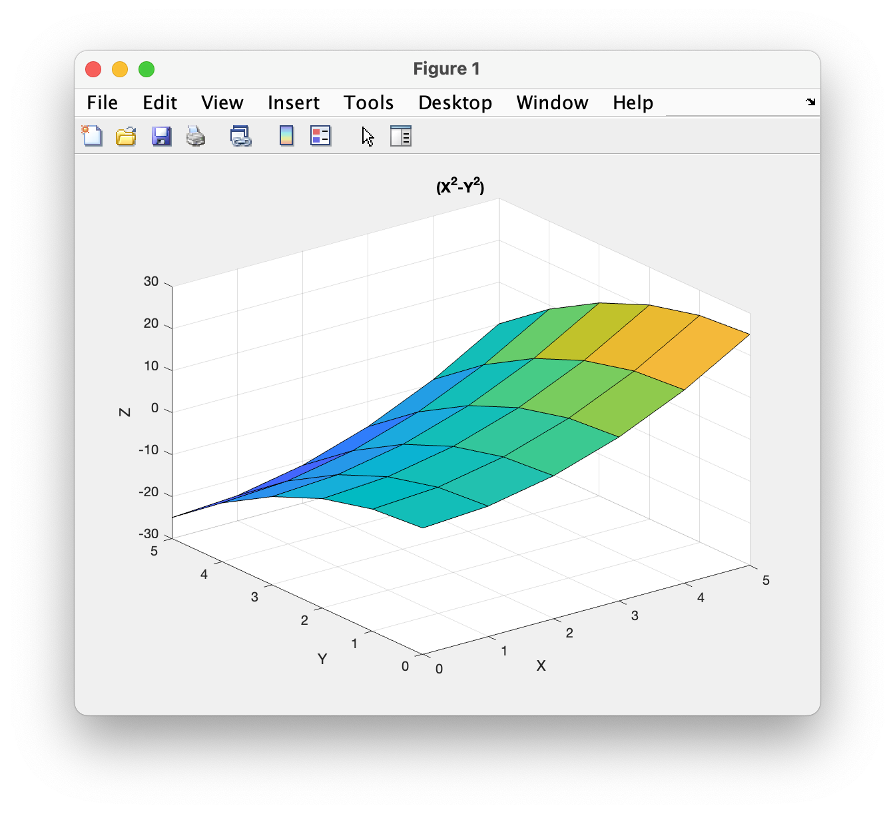

# Chapter 7 Tutorial 7
The purpose of this program is to demonstrate simple example of vectorizing a function of two variables. This process will allow us to make grid matrices of the indepedent variables and then using these matrices to compute the value of the function at each (x,y) coordinate and display the result in a surface plot.
```Matlab
% Clear the command window and all variables
clc       % Clear the command window contents
clear     % Clear the workspace variables
close all % Close any currently open plot figure windows
```
Edit the code below and update the variable named name with your **name** for this tutorial in the code below.
```Matlab
% Output of the title and author to the command window.
programName = "Tutorial_07_7";
name = "";
assistedBy = "";
fprintf("Output for %s written by %s, with assistance from %s.\n\n", programName, name, assistedBy)
```
## Mesh Grids
Let's assume we have a function `z = x^2 - y^2`. In this case we have 3 datasets; `x`, `y`, and `z`. The `meshgrid` and `surf` functions can be used here to help in calculating and displaying the values of a 3 parameter function.

Let's assume we want to calculate `z` where `x` and `y` are each between 0 and 5. The `meshgrid()` function will return two matrices. One matrix will have 0-5 in each row, repeated for 6 rows. Another matrix will have 0-5 in each column, repeated for 6 columns. This is what's referred to as a... mesh grid.
```Matlab
% Create a mesh grid of values from 0-5
[x, y] = meshgrid(0:5)
```
To further detail what we have here, x is now a matrix that contains the x coordinates of points on a grid. The `y` matrix holds the y coordinates of points on a grid. So, using `x(1,1)` and `y(1,1)` gives the coordinate 0,0. Using `x(3,3)` and `y(3,3)` would return the coordinate 2,3. Run the previous statement to see the values of x and y to make this more clear (the semicolon is left off for this reason)
## Computing Z
Recall that we want the `z` values for `x^2-y^2` where `x` and `y` are between 0 and 5. At this point we have the `x` and `y` values. To compute `z` values, we can simply use element-wise math which you already know well enough how to do, so compute the values of `z` here.
```Matlab
% Compute the vectorized function to get z values here

```
## Using surf
Now, we can use `surf` to generate a three-dimensional surface plot. The form is identical to plot only obviously with three values.
```Matlab
% Create the surface plot
surf(x, y, z)

% Add title, axis labels, and turn the grid on
title('(X^2-Y^2)')
xlabel('X')
ylabel('Y')
zlabel('Z')
grid on
```
The result is a plot showing the value of `z` `(x^2-y^2)` across a grid of x and y coordinates ranging from 0,0 to 5,5
# Additional Notes:
* 
# Example Output
Create a script of the same name, your output should match the following.
