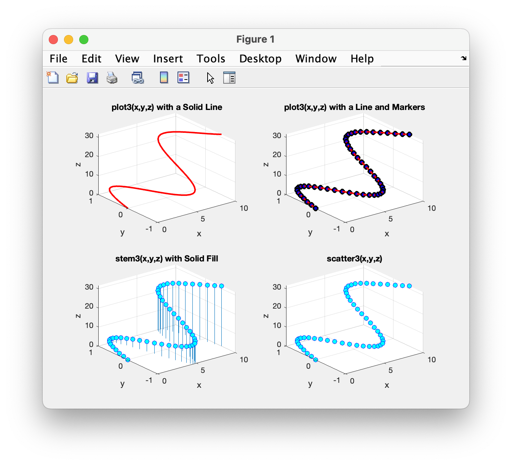
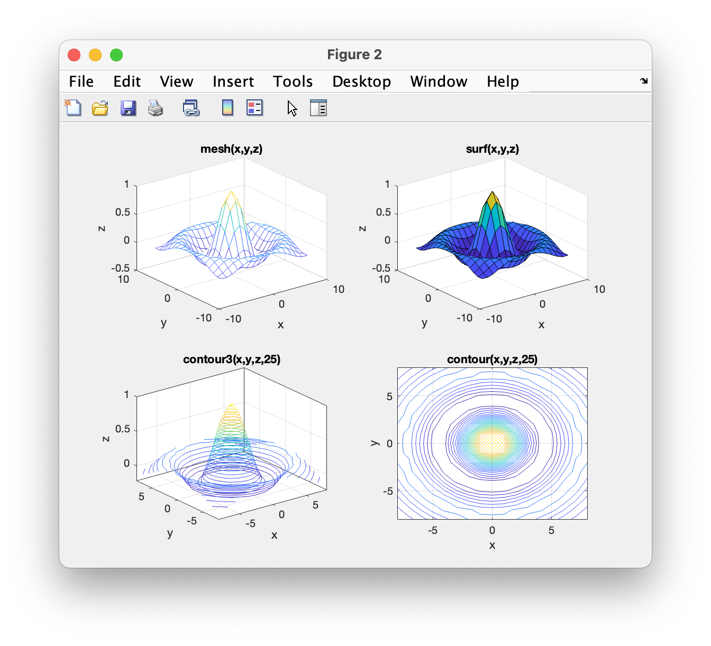

# Chapter 7 Tutorial 8
The purpose of this program is to demonstrate how to create a variety of 3D graphs in Matlab including `plot3()`, `scatter3()`, `stem3()`, `surf()`, `mesh()`, `contour3()`, and `contour()`. Finding the maximum of a function using the `fminsearch` function along with a contour plot will also be shown.
```Matlab
% Clear the command window and all variables
clc       % Clear the command window contents
clear     % Clear the workspace variables
close all % Close any currently open plot figure windows
```
Edit the code below and update the variable named name with your **name** for this tutorial in the code below.
```Matlab
% Output of the title and author to the command window.
programName = "Tutorial_07_8";
name = "";
assistedBy = "";
fprintf("Output for %s written by %s, with assistance from %s.\n\n", programName, name, assistedBy)
```
## Figure 1
### Input
We'll compute some, to you, arbitrary values to plot as `x`, `y`, `z`, using `sin()`
```Matlab
% computing the x, y, and z coordinates to plot
t = 0:0.2:10;
x = t;
y = sin(t);
z = t.^1.5;
```
### `plot3()` - Plain 3D Line
```Matlab
% Open Figure 1 and create a 2x2 grid of plots, activate the top left plot


% plot3() with a continuous line                
plot3(x,y,z,'r-','linewidth',2)
% add a grid, title, and labels
grid on
title('plot3(x,y,z) with a Solid Line') 
xlabel('x')
ylabel('y')
zlabel('z')
```
### `plot3()` - 3D Line with Markers
As with `plot()`, we can add markers to our line.
```Matlab
% Activate the upper right subplot


% plot3() with a line and markers 
plot3(x,y,z,'r-o','linewidth',2,'markersize',6,'markerfacecolor','b' ...
    ,'markeredgecolor','k')
% add a grid, title, and labels
grid on
title('plot3(x,y,z) with a Line and Markers') 
xlabel('x')
ylabel('y')
zlabel('z')
```
### `stem3()` - Curvy Markers with Stems
The `stem3()` plot shows the data points and their projection onto the x-y plane. This greatly enhances the ability of the reader to visualize how the 3 dimensions change.
```Matlab
% Activate the lower left subplot


stem3(x,y,z,'o','markersize',6, 'markerfacecolor','c','markeredgecolor','b')
% add a grid, title, and labels
grid on
title('stem3(x,y,z) with Solid Fill') 
xlabel('x')
ylabel('y')
zlabel('z')
```
### `scatter3()` - Curvy Markers
Notice, the `scatter3()` is identical to either a `plot3()` with only markers. However, `scatter3()` does not allow you to change the marker size.
```Matlab
% Activate the lower right subplot


scatter3(x,y,z,'o','markerfacecolor','c','markeredgecolor','b')
% add a grid, title, and labels
grid on
title('scatter3(x,y,z)') 
xlabel('x')
ylabel('y')
zlabel('z')
```
## Figure 2
In figure 2, we'll plot surface type plots including `mesh()`, `surf()`, `contour3()`, and `contour()`.
### Input
Again, we'll create some seemingly arbitrary values to plot for `x` and `y`. For surface type plots, we will almost always use the `meshgrid()` function for computing x and y coordinates.
```Matlab
% Define the x and y vectors
x = -8:8;
y = x;

% Create 2 matrices for x and y of the same size to represent all the (x,y)
% coordinates on the surface.
[xGrid,yGrid] = meshgrid(x,y);
```
Recall that `eps` is the smallest distance between two values in MATLAB (smallest increment). Remember that we may need to avoid divide by zero errors resulting in `NaN` or `inf` values. We do that by adding `eps` to the denominator which will have no discernable effect on the outcome.
```Matlab
r = sqrt(xGrid.^2 + yGrid.^2) + eps;
z = sin(r) ./ r;
```
### `meshgrid()` - A 3D Plot Appearing as a Mesh Surface
```Matlab
% Open Figure 2 and create a 2x2 grid of plots, activate the top left plot


% creates a mesh graph (colored wireframe)
mesh(x,y,z)
% add a grid, title, and labels
grid on
title('mesh(x,y,z)') 
xlabel('x')
ylabel('y')
zlabel('z')
```
### `surf()` - A 3D Plot Appearing as a Solid Surface
```Matlab
% Activate the upper right subplot


% surf() creates a colored surface plot
surf(x,y,z)
% add a grid, title, and labels
grid on
title('surf(x,y,z)') 
xlabel('x')
ylabel('y')
zlabel('z')
```
### `contour3()` - A 3D Plot Appearing as a Surface of Rings
```Matlab
% Activate the lower left subplot


% contour3() creates a 3D contour plot with 25 contour lines
contour3(x,y,z,25)
% add a grid, title, and labels
grid on
title('contour3(x,y,z,25)') 
xlabel('x')
ylabel('y')
zlabel('z')
```
### `contour()` - A 2D Overhead View of `contour3()`
Despite the difference in naming convention (the lack of a 3 in the name), contour is still a 3D plot. However, the z value is shown in a much different perspective than one would expect for a 3D plot. In this plot, the z dimension is interpreted only by the color of the contoured lines but makes it much easier to identify maxima and minima.
```Matlab
% Activate the lower right subplot


% contour() creates a 2D contour plot with 25 contour lines
contour(x,y,z,25)
% add a grid, title, and labels
grid on
title('contour(x,y,z,25)') 
xlabel('x')
ylabel('y')
zlabel('z')
```
The contour plot shows that the maximum of z(x,y) occurs at about (0,0). The `fminsearch()` function can be used to find a minimum or maximum. To find a maximum the function must first be negated and written using a vector cotaining the two independent variables.

Here, we create a negating function. Again we see the `@(x)` notation, we learned that this is a function handle and, as before, this one is a handle to an anonymous function. A function handle is merely a value or, a pointer to a place in computer memory. Therefore, just like any other value stored in memory, we can store the handle (pointer) to a function so we can reuse it. In this case, we're simply breaking up the code a bit to make it more digestible by human eyes.
```Matlab
% NegFunction = @ represents the notation for an annonymous function.  It
% creates a function named NegFunction(x) where x is a vector of independent
% variables.
negFunction =  @(x)((-1*sin(x(1)^2+x(2)^2+eps))/(x(1)^2+x(2)^2+eps));
```
The `fminsearch()` function here is taking two arguments, the function handle, and a 2-element vector containing the initial guess of the coordinates where the maximum occurs. We are using `(0.1,0.1)` which is very close so it should have no problem finding our answer very quickly.
```Matlab
% The values [0.1,0.1] are the initial guess of where the maximum occurs
[xyMaxVector,zMax] = fminsearch(negFunction,[0.1,0.1]);

% Print out the maximum of the function along with the coordinates at which
% the maximum occurs.  Note that we must negate the z value to represent the 
% maximum.
fprintf('The maximum value was z(%6.3f , %6.3f) = %2.0f\n', xyMaxVector(1) ... 
     ,xyMaxVector(2),-zMax)
```
# Additional Notes:
* 
# Example Output
Create a script of the same name, your output should match the following.

