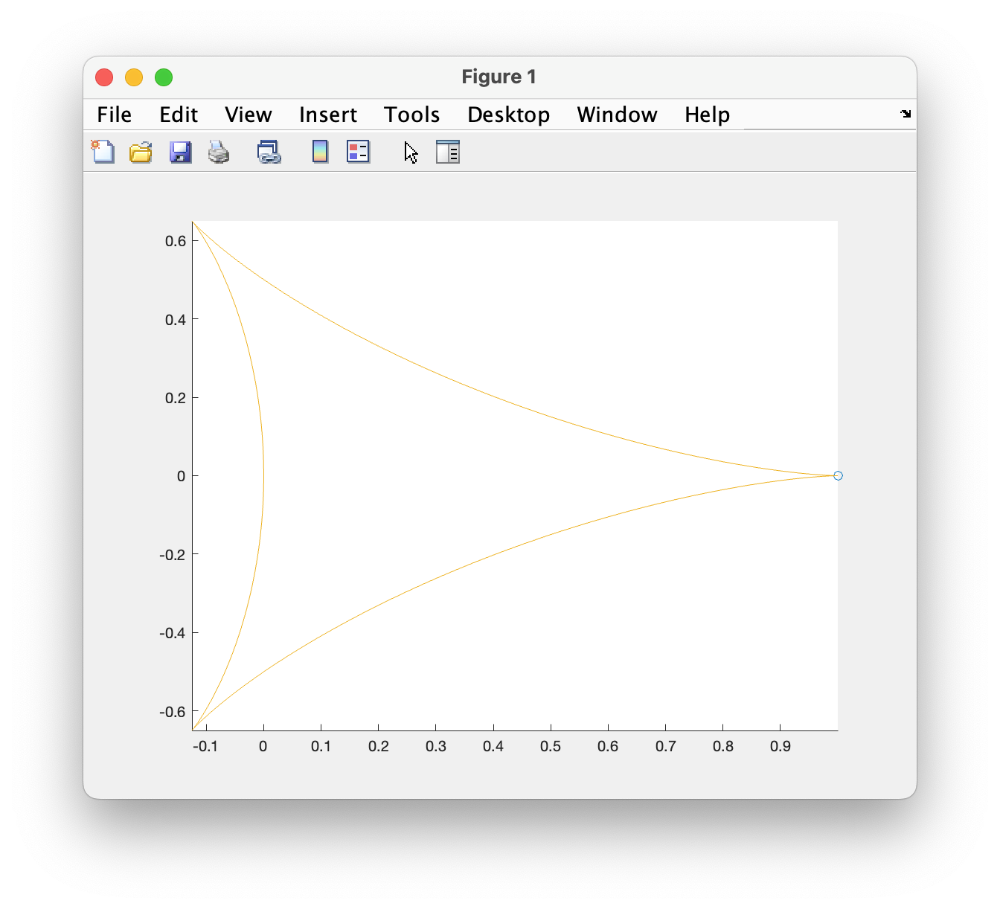
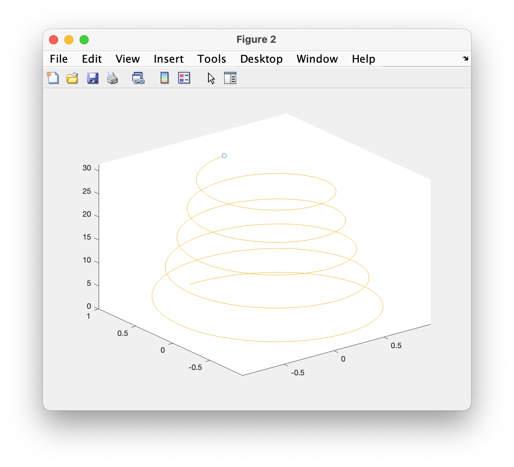
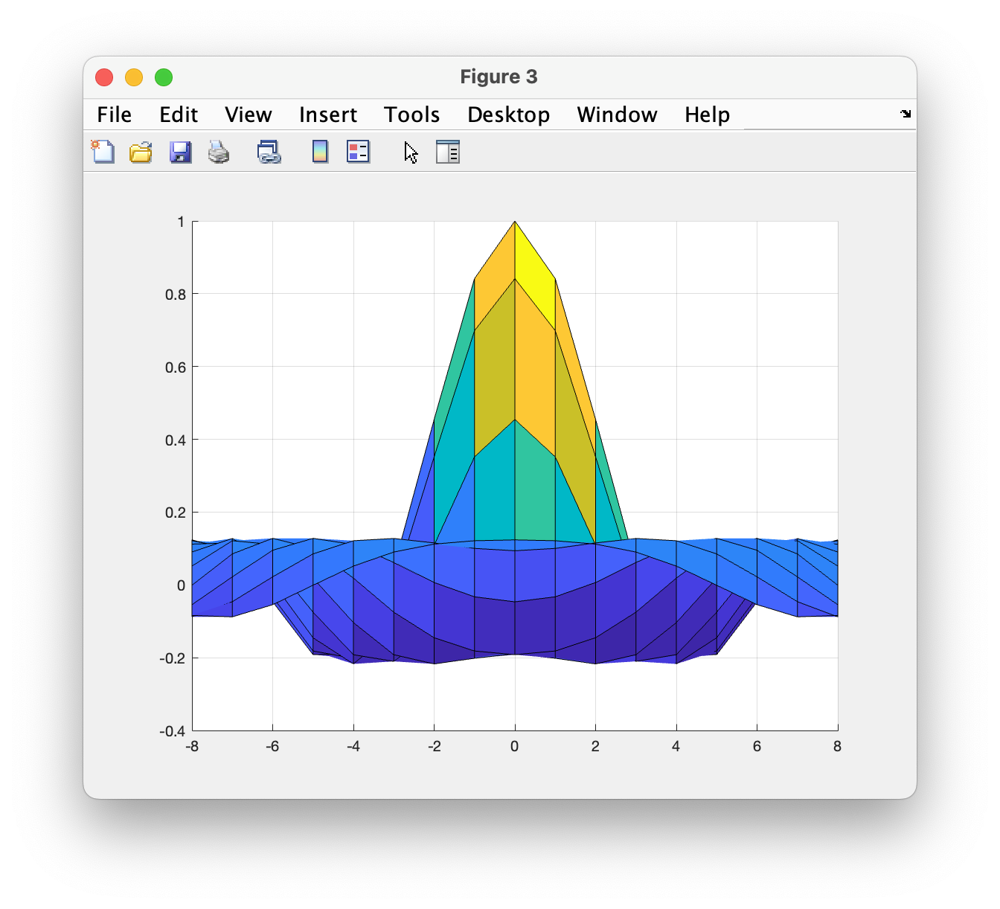
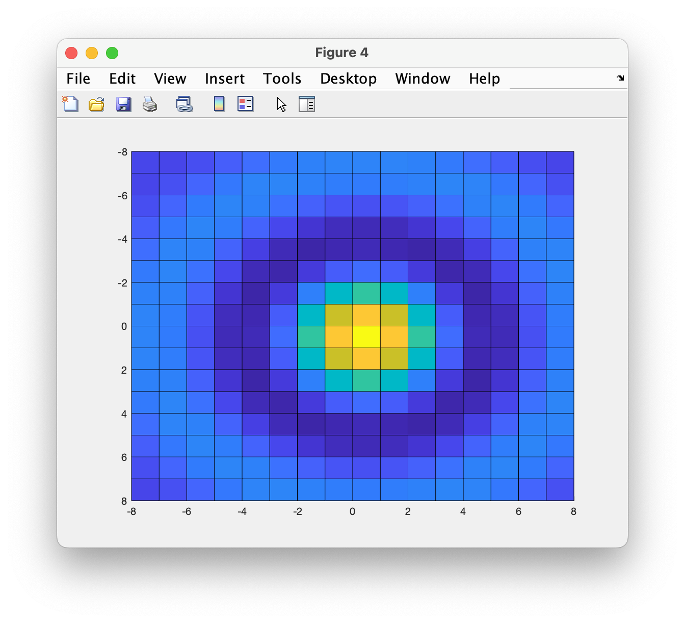

# Chapter 7 Tutorial 9
The purpose of this program is to demonstrate how graphs can be animated in matlab. The `comet()` and `comet3()` plots trace the path of 2D and 3D graphs respectively. A `surf()` plot can be animated by changing the azimuth and elevation angles with a for-loop.
```Matlab
% Clear the command window and all variables
clc       % Clear the command window contents
clear     % Clear the workspace variables
close all % Close any currently open plot figure windows
```
Edit the code below and update the variable named name with your **name** for this tutorial in the code below.
```Matlab
% Output of the title and author to the command window.
programName = "Tutorial_07_9";
name = "";
assistedBy = "";
fprintf("Output for %s written by %s, with assistance from %s.\n\n", programName, name, assistedBy)
```
## Comet
Animation of a 2D plot with `comet()`. The length of time for an animation to complete is directly correlated with the number of points in its dataset due to the fact that the speed is constant.
### Figure 1
The `comet()` function creates a 2D animation.
```Matlab
% Open a Figure 1 window
figure(1)

points = 10000;
t = linspace(0,pi,points);
x = cos(2*t).*(cos(t).^2);
y = sin(2*t).*(sin(t).^2);
comet(x,y);
```
### Figure 2 
The `comet3()` function creates a 3D animation.
```Matlab
% Open a Figure 2 window
figure(2)

t = linspace(0,10*pi,points);
comet3(exp(-0.02*t).*sin(t),exp(-0.02*t).*cos(t),t);
```
### Figure 3
Here's a repeat of a plot we've seen before, but here we'll see how we can programmatically change the view using the `view()` function. We'll also show how you can avoid a rather nasty bug when changing the values of an existing figure when there are multiple figures.

As an exercise, run this code, and when figure three opens up, click any other figure. You'll see that our alterations are taking effect on the currently active figure. So, clicking a figure window and making it the active window is equivalent to typing figure(n), all future code will affect that figure window.
```Matlab
% Open a Figure 3 window
figure(3)

x = -8:8;
y = x;
[xGrid,yGrid] = meshgrid(x,y);
r = sqrt(xGrid.^2 + yGrid.^2) + eps;
z = sin(r) ./ r;

% Set the elevation angle that we will view the graph to 0 degrees 
el = 0;

% The for loop changes the azimuth angle that the graph will be viewed from
for az = -90:15:90
    surf(x,y,z)
    view(az,el)  % view changes the viewpoint used to display the plot.
    pause(0.5)  % pause before drawing the next graph
end
```
### Figure 4
Admittedly, this is an unreliable "hacky" way of handling this but, by activating the desired figure before performing the repeated operations, we can avoid writing to the wrong figure when a user clicks on a different figure window. There is still the possibility that they click another figure window the split second between when `figure(4)` is called and the `surf()` and `view()` functions execute but it's a much better solution than hoping the user won't click another figure window.
```Matlab
% Open a Figure 4 window
figure(4)

% We'll reuse the values from Figure 3

% set the azimuth to 0 degrees
az = 0;

% change the elevation using the for loop
for el = 90:-15:-90
    figure(4) % ***IMPORTANT***
    surf(x,y,z)
    view(az,el)
    pause(0.5)
end
```
# Additional Notes:
* 
# Example Output
Create a script of the same name, your output should match the following.



