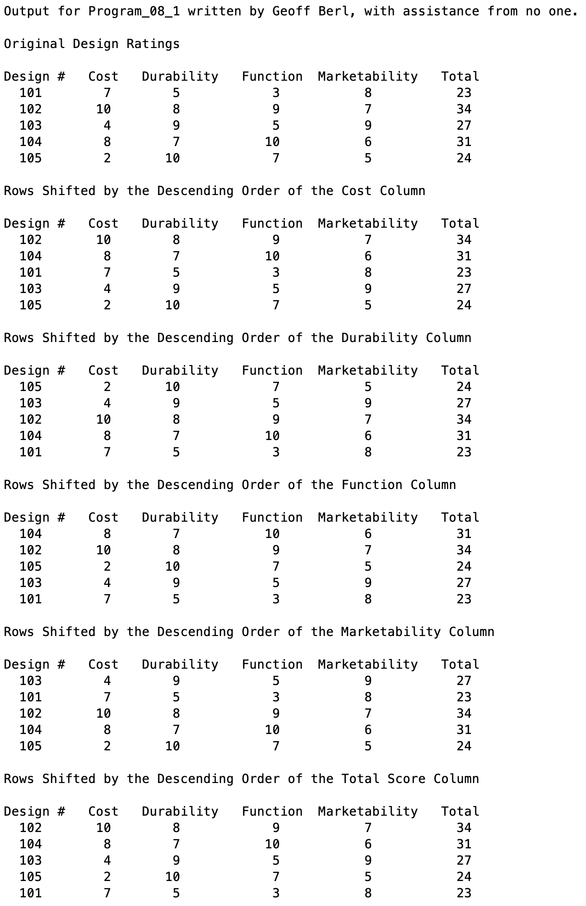

# Program\_08\_1
## Requirements
The purpose of this program is to read in design rating data from the file named `Data_08_1.txt`. Output the data in table form in its original form then sorted in descending order according to the cost, durability, function, marketability, and total score columns.

**Note:** The columns of data are in the order specified in the above paragraph.
## Program
Use the code below to start your M file and complete the requirements stated above

### Tips
* 

```Matlab
% Program Description:
% The purpose of this program is to ...

% Clear the command window and all variables
clc     % Clear the command window contents
clear   % Clear the workspace variables

% Output of the title and author to the command window.
programName = "Program_08_1";
name = "";
assistedBy = "";
fprintf("Output for %s written by %s, with assistance from %s.\n\n", programName, name, assistedBy)


```
## Example Output
Create a script of the same name, your output should match the following.
