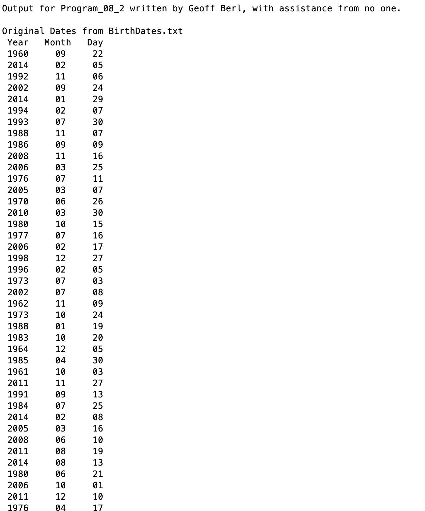
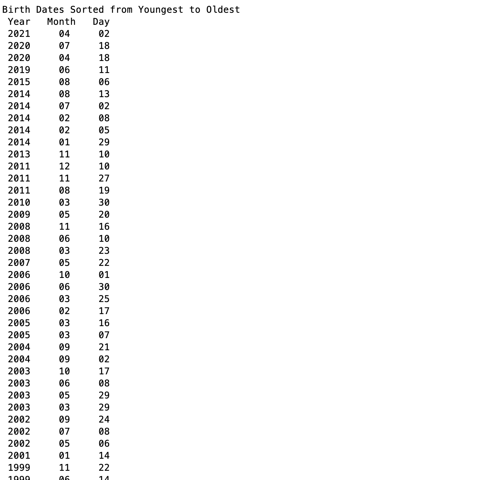
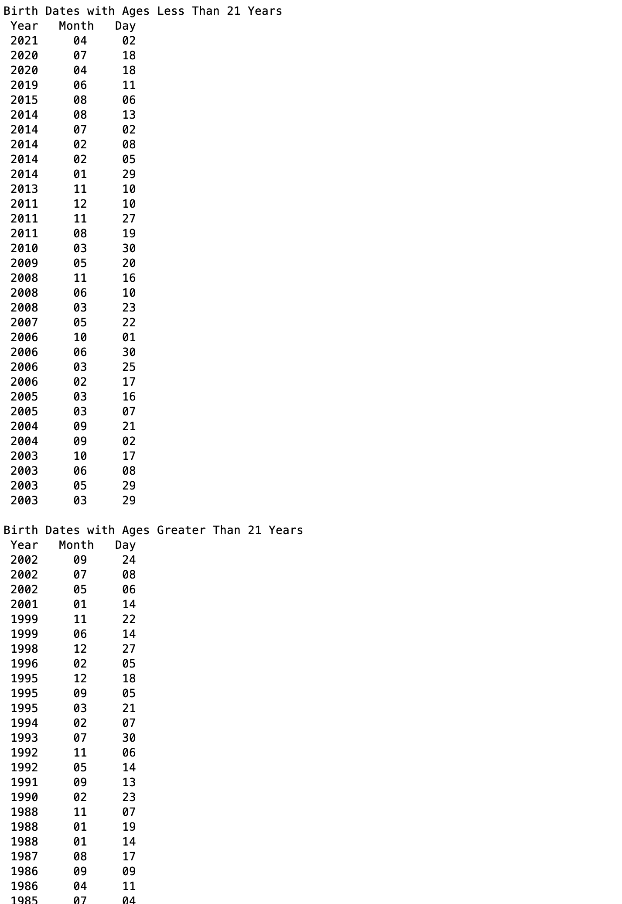

# Program\_08\_2
## Requirements
Your MATLAB script must
* Read in birthdates from the file named `BirthDates.txt` (use the `importdata` function). 
* Output the original data in table form in its original order
* Output the original data sorted in ascending order by age using a user-defined function named `dateSort()`. (The `dateSort()` function **file** is provided for you, although you need to write the algorithm for the function)
* Output the sorted data containing birthdates under 21 using a user defined function named `over21()` (The `over21()` function file is provided for you and, again, you create the algorithm). Do not simply delete the over 21 dates to obtain under 21 dates. Use your knowledge of logical arrays and logical operators to (very easily) obtain the under 21 dates.
* Output the sorted data containing birthdates over 21 using a user-defined function named `over21()`.
* Use the current date. Note that this may result in your output being slightly different compared to what you see in the example output since I ran my program on a different day.
## Program
Use the code below to start your M file and complete the requirements stated above

### Tips
* `importdata()` will import the data as a struct, so I would suggest using the command window to mess around with the imported data to get an idea of what it looks like and how it is structured.

```Matlab
% Program Description:
% The purpose of this program is to ...

% Clear the command window and all variables
clc     % Clear the command window contents
clear   % Clear the workspace variables

% Output of the title and author to the command window.
programName = "Program_08_2";
name = "";
assistedBy = "";
fprintf("Output for %s written by %s, with assistance from %s.\n\n", programName, name, assistedBy)


```
## Example Output
Create a script of the same name, your output should match the following. (Note that to save space, some lists are cut short indicated by ...)

…

…
