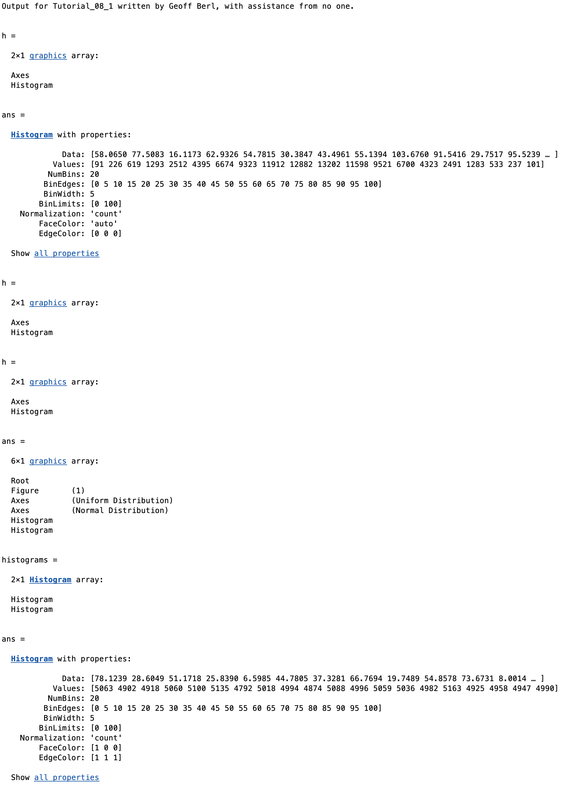

# Chapter 8 Tutorial 1
The purpose of this program is to demonstrate how to create both normal and uniform distributions and to plot them in a histogram plot. The `histogram()` function will also be used to create a table of frequencies.

```Matlab
% Clear the command window and all variables
clc       % Clear the command window contents
clear     % Clear the workspace variables
close all % Close any currently open plot figure windows
```
Edit the code below and update the variable named name with your **name** for this tutorial in the code below.
```Matlab
% Output of the title and author to the command window.
programName = "Tutorial_08_1";
name = "";
assistedBy = "";
fprintf("Output for %s written by %s, with assistance from %s.\n\n", programName, name, assistedBy)
```
## Input
Using the `randn()` function to create a row vector of 100,000 values with a mean of 50 and stdev of 15. Refer to your notes from previous chapters if you do not remember how to do this.
```Matlab
% Create a row vector of 100,000 values with a mean of 50 and stdev of 15
normal = ;
% Using the rand() function to create a uniform distribution from 0 to 100
uniform = 100*rand(1,100000) + 0;
```
Here we'll create some "bins". Bins are the containers that values will be stored in. The bin center is the value at the center of the bin.
```Matlab
binCenters = 2.5:5:97.5;
% Bin boundaries are the left and right boundaries of the bins
binBoundaries = 0:5:100;
```
## Creating The Plots
### Plot 1 - Normal Distribution
Create a histogram with the normal and uniform distribution datasets.
```Matlab
% Open figure 1


% Create 2 subplots, one on top of the other, activate plot 1

```
Here, we will create a histogram of the normal distribution using the binCenters vector to define the bins to use. You'll see the `set()` command, this is used to update the property of some object, here we are updating the tick values to appear at the boundaries of the bins.
```Matlab
histogram(normal, binBoundaries)
% Set the tick mark labels at each bin center
set(gca,'xtick', binCenters)
% Set the axis limits
axis([0 100 0 2500])
% override the y axis limits with autoscaling
axis 'auto y'
```
These next two commands control the face color and edge color of the bars on the histogram. These could be set in the original `histogram()` function or later using the `set()` function. The `findobj()` function is a powerful function to find graphical objects. In order to use `set()` we need the "handle" of the object we want to change. We find that here with `findobj()` where gca stands for get current axes (remember axes in matlab is the entire plot). 

Once we have the handle of the axes (the current histogram), we can set the face and edge colors how we want using  the axes' property names like `FaceColor` and `EdgeColor`. It should be noted that the resulting handle of the plot is a an array of two structs as you'll see printed out since I have not suppressed the output.
```Matlab
% Get the handle to the current plot (returns a 2x1 "Group" or array)
h = findobj(gca)
```
Now that we have the handle, we can see the various properties of the plot struct (which is the second element in the array)
```Matlab
% Display the properties we can work with
h(2)
% Update the properties of the plot with the handle and property names
set(h(2),'FaceColor','g','EdgeColor','k')
```
Notice here, we are using our previous `labelPlot()` function, you'll either need to copy the file from the previous week into this current folder or, add the function to the MATLAB path.
```Matlab
% Use your LabelPlot() function to label the graph
labelPlot('Normal Distribution','Bin Boundaries','Frequency')
```
### Plot 2 - Uniform distribution
```Matlab
% Create the second plot in figure window 1
subplot(2,1,2)
% Make a historgram of the uniform distribution, it's the same as the
% normal distrubution, just use the uniform data instead.
histogram(uniform, binBoundaries)

% The following lines control the second graph as described above
set(gca,'xtick',binCenters)
axis([0 100 0 2500])
axis 'auto y'
```
Here, we will update the edge and face colors of this histogram to have a red face color with a white edge color. However, this time we'll use the structure properties directly which is slightly more intuitive.
```Matlab
% Get the handle to the current plot
h = findobj(gca);
% Update the properties of the plot with the handle and property names
h(2).FaceColor = 'r'
h(2).EdgeColor = 'w'
```
Label this plot just like the previous one.
```Matlab
labelPlot('Uniform Distribution','Bin Boundaries','Frequency')
```
We can also use the properties of histograms to get other information, like bin counts and more.

Here is how we might go about finding and editing properties if we don't know what object we're looking for yet.

First, let's just run `findobj()` and see what comes back, this will find ALL graphic objects. 
```Matlab
findobj()
```
So, we can see there is Root (ignore that for now), Figure, two Axes and two Histograms. If we want to get propertes from the Histogram objects, we can filter `findobj` by finding only Histogram objects.
```Matlab
histograms = findobj('Type', 'Histogram')
```
Great, now we have just the histogram objects, let's see what the first one looks like.
```Matlab
histograms(1)
```
We can see by the data that this is the uniform distribution, we know this because the values are relatively consistent. Also, if we look at FaceColor and EdgeColor these numbers are for the R, G, B components and [1 0 0] means red, [1, 1, 1] means white ([0 0 0] would be black)

We can also see that there is lots of information we can pull from here, such as the data and values, and even more if we "Show all properties"

Let's create a table of the data by extracting the information from the histogram. Note, the order of your histograms may be different so adjust the subscript as necessary.
```Matlab
% We know the first Histogram object was the uniform distribution
freqUniform = histograms(1).BinCounts;
freqNormal = histograms(2).BinCounts;

% Print the heading of the table
fprintf(' Bin      Normal    Uniform \n')
fprintf('Center  Frequency  Frequency \n')
% Create a matrix named table with three rows
table = [binCenters; freqNormal; freqUniform];
% Print the table values three per line
fprintf(' %4.1f \t  %5i \t %5i\n',table)
```
# Additional Notes:
* 
# Example Output
Create a script of the same name, your output should match the following.


