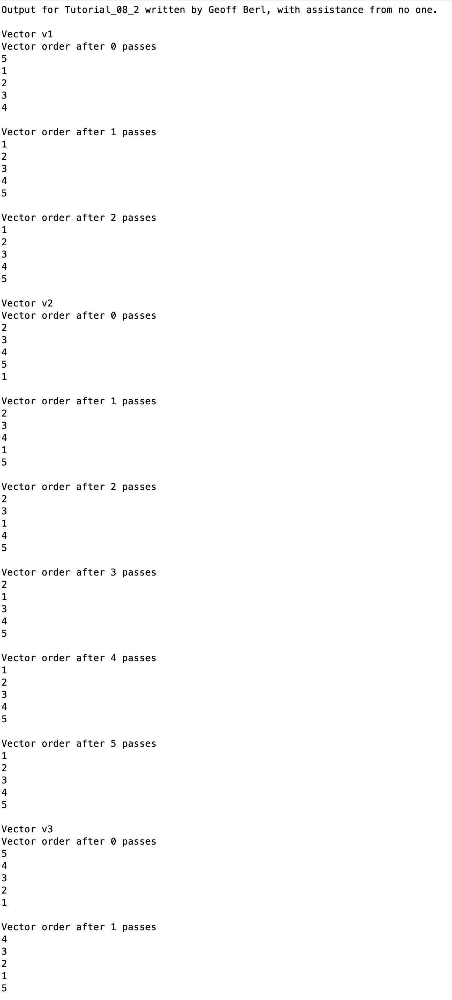
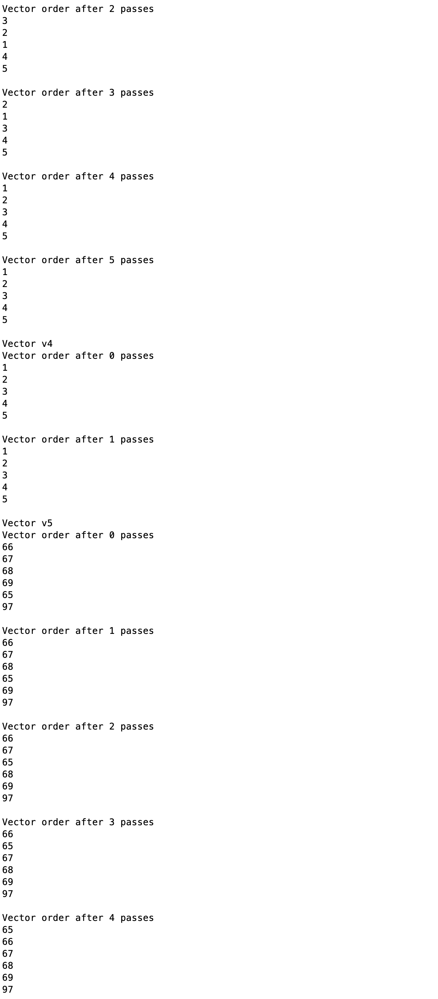
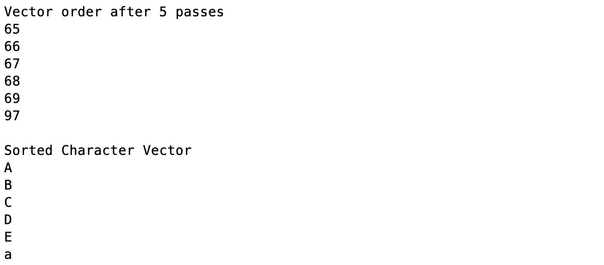

# Chapter 8 Tutorial 2
The purpose of this program is to demonstrate how a Bubble sort is used to sort a list into ascending order. Note that the bubble sort always makes one extra pass after the vector is sorted. This is because the only way that the function knows that the sort is complete is if it passes through the vector without having to switch any values.

```Matlab
% Clear the command window and all variables
clc       % Clear the command window contents
clear     % Clear the workspace variables
close all % Close any currently open plot figure windows
```
Edit the code below and update the variable named name with your **name** for this tutorial in the code below.
```Matlab
% Output of the title and author to the command window.
programName = "Tutorial_08_2";
name = "";
assistedBy = "";
fprintf("Output for %s written by %s, with assistance from %s.\n\n", programName, name, assistedBy)
```
### Vector 1
```Matlab
% Vector v1 with only one element out of order, largest element first
fprintf('Vector v1') % print the vector name
v1 = [5 1:4];  % define the vector
bubble(v1);     % send the vector to the bubble() function
```
### Vector 2
```Matlab
% Vector v2 with only one element out of order, smallest element last
fprintf('\nVector v2')
v2 = [2:5 1];
bubble(v2);
```
### Vector 3
```Matlab
% Vector v3 with elements in descending order
fprintf('\nVector v3')
v3 = 5:-1:1;
bubble(v3);
```
### Vector 4
```Matlab
% Vector v4 with all elements in ascending order
fprintf('\nVector v4')
v4 = 1:5;
bubble(v4);
```
### Vector 5
When sorting characters, the ASCII (numerical) value of the character is used to sort. In an ASCII chart, you can see that Capital letters come before lowercase letters. This is how computers (which can only deal with numbers) are able to sort text, humans created a pattern that places characters in the correct order when sorted by their numerical value. Older operating systems or Unix based systems (like Mac, Linux, etc) still sort files by first looking at the capital letters, which is why you'll often see the file README displayed in all caps, it will generally place this file at the top if other files are named using lowercase values thus making it the first file someone sees and can open it for information.
```Matlab
% Vector v5 with character elements
fprintf('\nVector v5')
v5 = ['B' 'C' 'D' 'E' 'A' 'a'];
sorted = bubble(v5); % prints the order using the ASCII numerical values
                     % A = 65, B = 66, C = 67, D = 68, E = 69, a = 97
fprintf('\nSorted Character Vector\n')
% prints the sorted vector using a %c format that outputs the character
% values of the vector instead of their ASCII values
fprintf('%c\n',sorted);
```
# Additional Notes:
* 
# Example Output
Create a script of the same name, your output should match the following.


