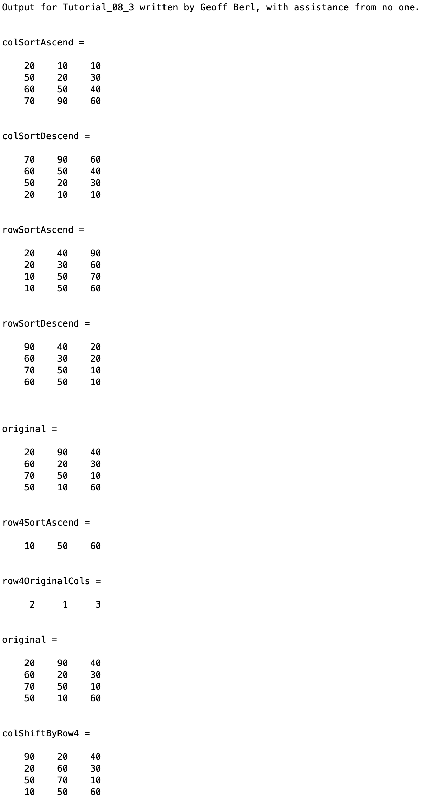

# Chapter 8 Tutorial 3
The purpose of this program is to demonstrate how to use Matlab's `sort()` function to sort a matrix by rows or columns and either in ascending or descending order. This program will also show how entire columns can be shifted based on the ascending order of a given row.

```Matlab
% Clear the command window and all variables
clc       % Clear the command window contents
clear     % Clear the workspace variables
close all % Close any currently open plot figure windows
```
Edit the code below and update the variable named name with your **name** for this tutorial in the code below.
```Matlab
% Output of the title and author to the command window.
programName = "Tutorial_08_3";
name = "";
assistedBy = "";
fprintf("Output for %s written by %s, with assistance from %s.\n\n", programName, name, assistedBy)
```
## Input
```Matlab
% Define the original matrix
original = [20 90 40
            60 20 30
            70 50 10
            50 10 60];
```
## Manipulation
The `sort()` function takes a number of parameters, the first being the only required parameter, and that is the data to be sorted. An optional second parameter is the dimension, that is, the dimension to sort; 1 for columns, 2 for rows. By default, if the data is a vector it will sort the vector regardless of whether it is a column or row vector. If the data is a matrix, MATLAB will sort by column as default. An optional third parameter is sort type, by default the sort type is ascend, which places the smallest number at the top, or left, depending on column or row sort respectively.
```Matlab
% 1 means sort columns, if 'ascend' is omitted the default is ascend        
colSortAscend = sort(original,1)
colSortDescend = sort(original,1,'descend')
% 2 means sort by rows
rowSortAscend = sort(original,2,'ascend')
rowSortDescend = sort(original,2,'descend')
% output the original matrix for easy comparison
disp(' ')
original
```
### Sort all data by one row or col
Let's say we want to sort ALL matrix data by using the sorting results of only one row. This would be the equivalent of Excel sorting by row x (or in this case, we're using row 4). We'll sort row 4, capture the the new order of the original column values, and adjust the remaining rows using that data.

Here we'll sort just one row from the original data. We'll also see that `sort()` can return two values, the resulting sorted data, along with the original row or column number from which that data came.
```Matlab
% Sort original's row 4, row4SortAscend is a vector with the contents of
% row 4 in ascending order. Row4OriginalCols is a vector showing each sorted
% element's original column number 
[row4SortAscend,row4OriginalCols] = sort(original(4,:),2,'ascend')
```
After running this, we see that columns 1 and 2 were swapped, hence `row4OriginalCols` is `[2 1 3]`

It is faster and less memory intensive to pre-allocate space in a matrix so the data structure is not recreated or expanded as a loop is adding data to rows or columns that don't initially exist.

Here, we'll go through the rows of the original data and swap the columns so they match the order of `row4OriginalCols` which will effectively order the entire matrix based on one row's sorted data.
```Matlab
% preallocate memory for the ColShiftByRow4 Matrix
nRows = size(original,1);
nCols = size(original,2);
colShiftByRow4 = zeros(nRows,nCols);

% Use a for loop to shift the columns of each row of the original vector into an
% order determined by the ascending order of row 4.
for n = 1:nRows
     % uses the row4OriginalCols vector to re-arrange each row (n,:) into
     % the order determined by row4OriginalCols.
     colShiftByRow4(n,:)= original(n,row4OriginalCols);
end
% outputs the new matrix with columns shifted according to the ascending
% order of row 1
original
colShiftByRow4
```
So, we can see that row four is sorted in ascending order, and all corresponding rows are sorted in that same pattern. Meaning that the data for each column still has the same values as the original matrix, just now they're sorted based on row four ascending.
# Additional Notes:
* 
# Example Output
Create a script of the same name, your output should match the following.
