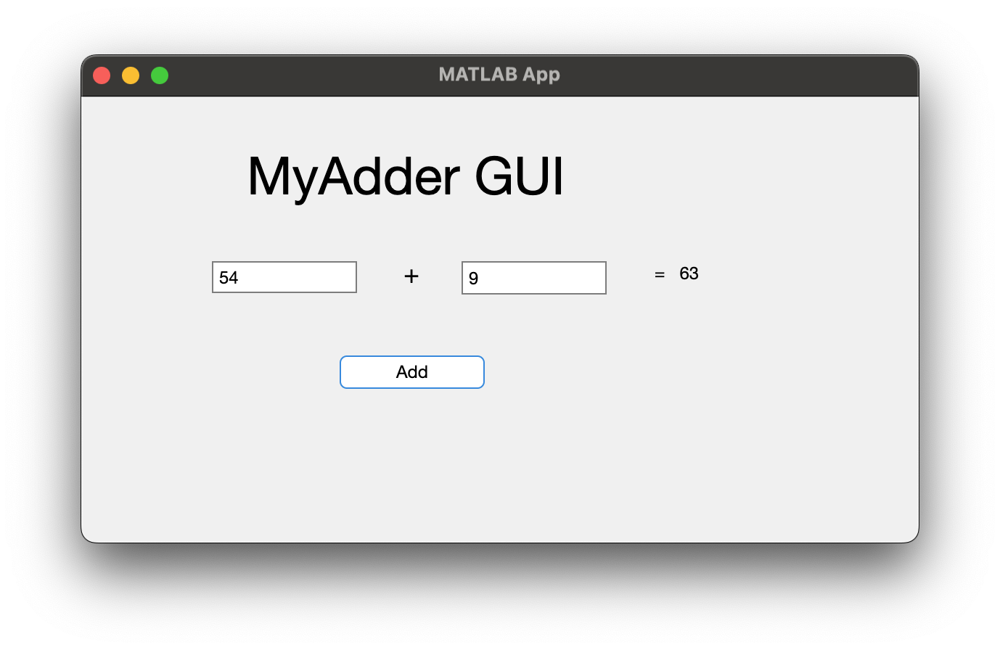

# Program\_09\_1
## Requirements
Create a Graphical User Interface that:
* Has a title called "MyAdder GUI"
* Accepts two inputs via text fields ranamed to tfOperand1 and tfOperand2
* Has a button labeled "Add" renamed to btnAdd
* Provides the summed result of two inputs via a button press and displays with a label field. 
* The label field shall be renamed to lblResult
* The label field shall be blank when the GUI first opens
* All GUI objects shall be renamed using the `prefixName` convention

Save the file as **Program_09_1.mlapp**

**Notes: **
* Be sure to test your program with multiple inputs
* Be sure your fields are large enough to handle inputs (fields should not be cut off)
* Be sure to suppress outputs where necessary, an app should not be displaying data to any command window or other output.
## Example Output
Your GUI layout should look similar to the following, you may play around with the design however, it should be intuitive to use and satisfy all requirements listed above
