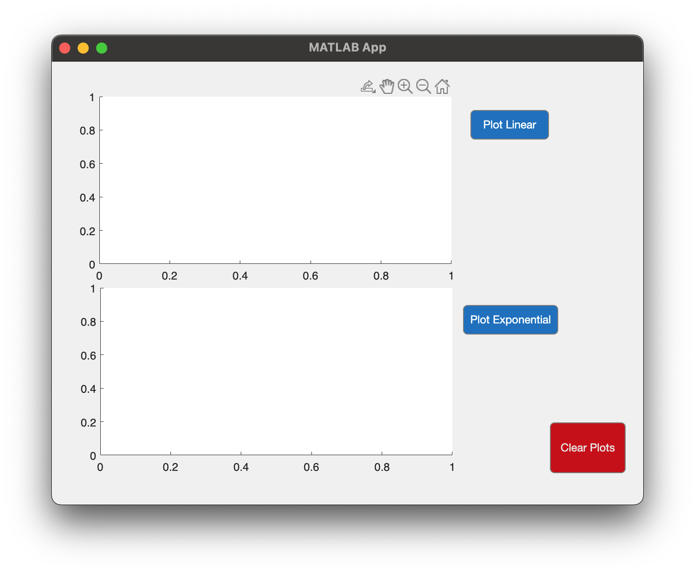
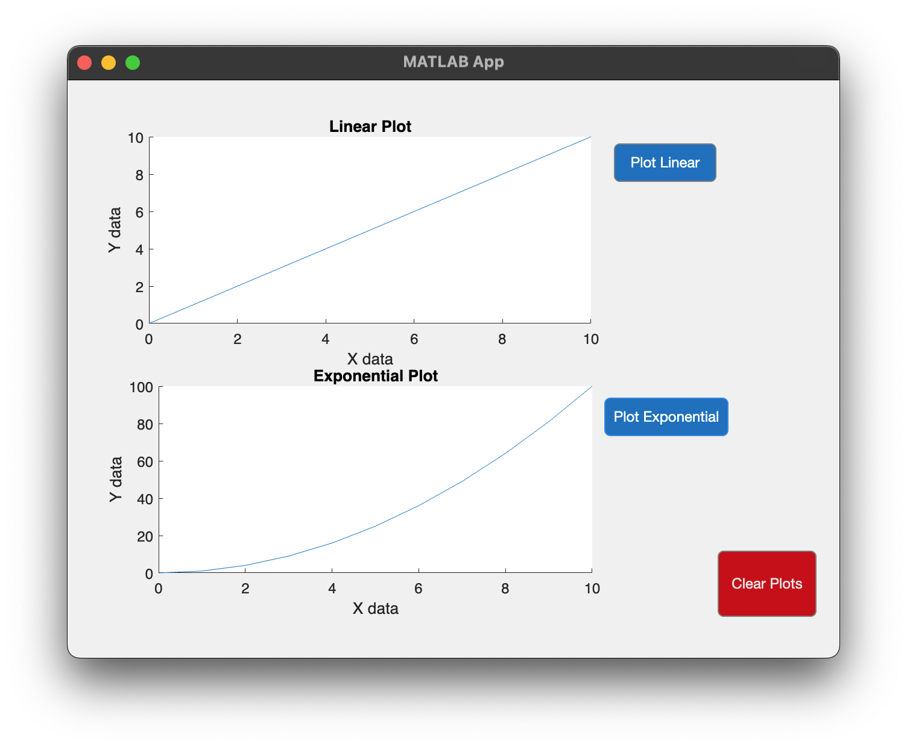

# Program\_09\_2
## Requirements
Create a Graphical User Interface that meets the following requirements:
* Contains two plots (axes) named pltLinear and pltExponential.
* Plots are empty upon first opening the GUI
* Contains one button for each plot to trigger the plotting of data
* When a plot button is pushed, it shall plot, label, and title the data accordingly
* Has a button labeled "Clear Plots" renamed to btnClearPlots
* The Clear Plots button shall clear both plots of their data, labels, and titles
* Provides the summed result of two inputs via a button press and displays with a label field. 
* The label field shall be renamed to lblResult
* The label field shall be blank when the GUI first opens
* All GUI objects shall be renamed using the `prefixName` convention

Save the file as **Program_09_2.mlapp**

**Notes: **

## Example Output
Your GUI layout should look similar to the following, you may play around with the design however, it should be intuitive to use and satisfy all requirements listed above

