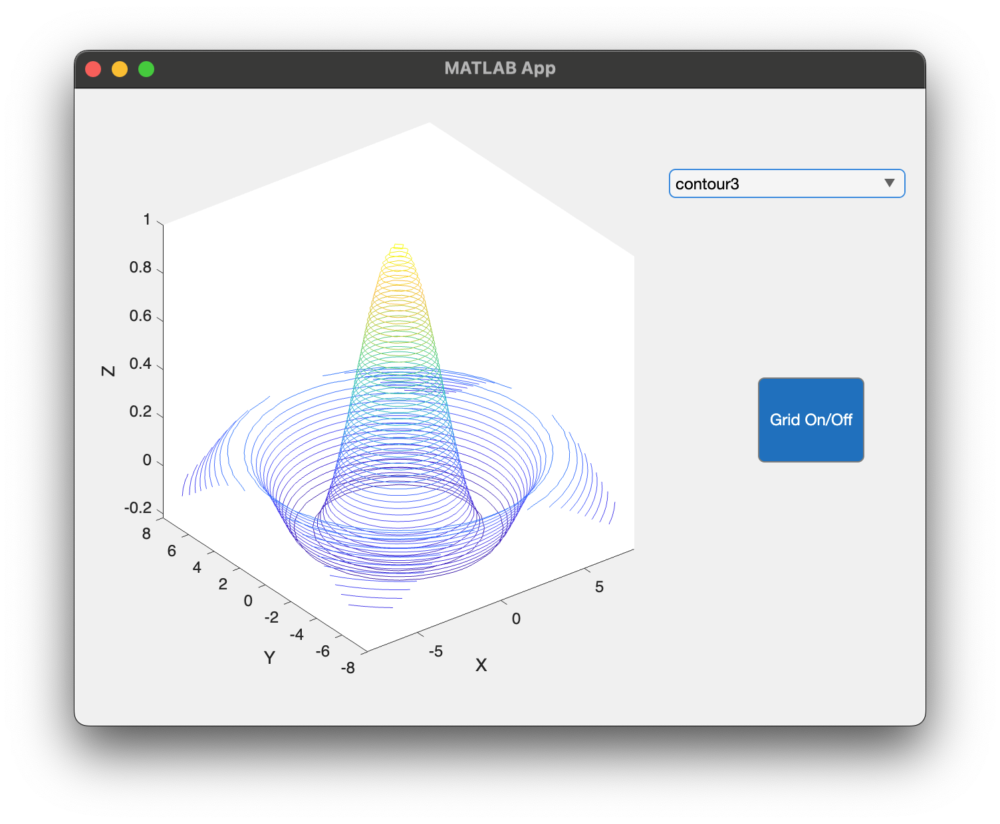

# Program\_09\_3
## Requirements
Create a Graphical User Interface that meets the following requirements:
* Given the following data
```Matlab
% Create a 2D mesh with x and y from -8 to 8 in steps of 0.5
[x,y] = meshgrid(-8:.5: 8);
r = sqrt(x.^2+y.^2) + eps;
z = sin(r)./r;
```
* Shall have one plot (axes)
* Plot shall initially have X, Y, and Z labels as the respective letters (see example output)
* Shall have one drop down list with choose, plot3, waterfall, contour3, and contour as options.
* If choose is selected, clear the plot, otherwise display the plot selected (create a selection change function) plot with the given data
* Add a minimum of 50 levels of contour for both the contour3 and contour selections,
* Shall have a button to toggle the plot grid on and off
* The `x`, `y`, and `z` data only needs to be generated one time so it should be placed in the "startup function" and stored in the `UserData` struct
* All GUI objects shall be renamed using the `prefixName` convention

Save the file as **Program_09_3.mlapp**

**Notes: **
* 

## Example Output
Your GUI layout should look similar to the following, you may play around with the design however, it should be intuitive to use and satisfy all requirements listed above





