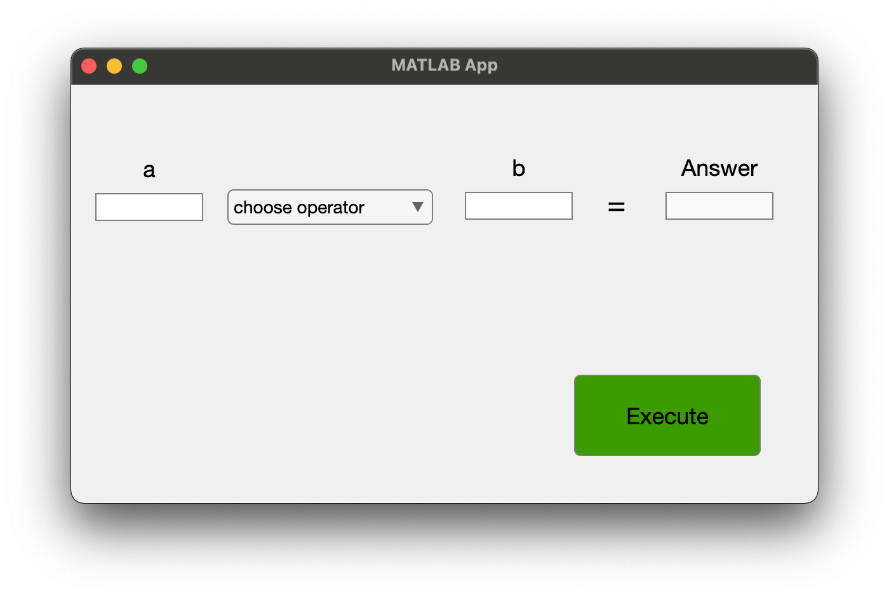
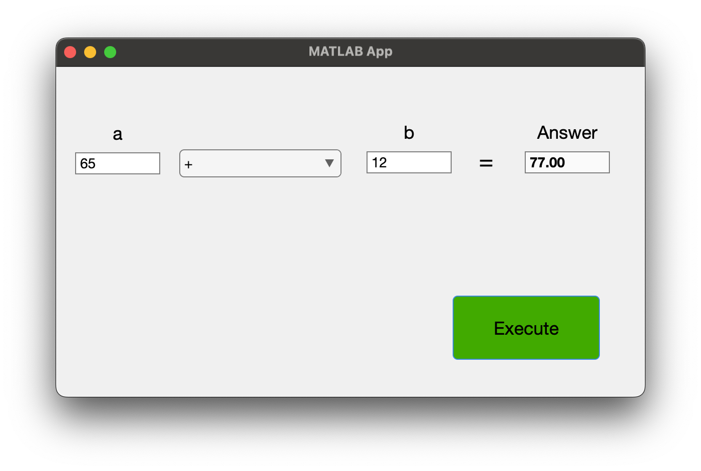
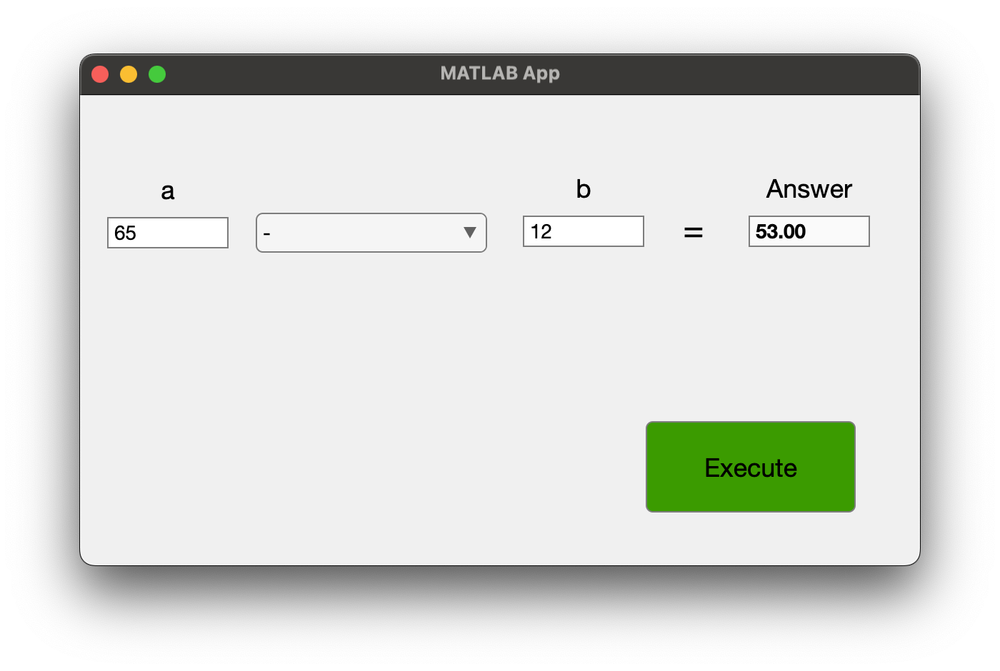

# Program\_09\_4
## Requirements
Create a Graphical User Interface that meets the following requirements:
* Shall have one text field labeled "a" for operand A which only allows numerical entries
* Shall have one text field labeled "b" for operand B which only allows numerical entries
* Shall have a drop down list of witht the following selections; choose operator, +, -, *, /
* Shall have a non-editable text field labeled "Answer"
* Shall have a button labeled "Execute" which will perform the selected action on operands a and b, and provide the result in the answer text field.
* Shall display the answer with two decimal precision
* Executing the choose operator shall clear the text fields
* All GUI objects shall be renamed using the `prefixName` convention

Save the file as **Program_09_4.mlapp**

**Notes: **
* 

## Example Output
Your GUI layout should look similar to the following, you may play around with the design however, it should be intuitive to use and satisfy all requirements listed above

**Selecting "choose operator" clears the text fields**
