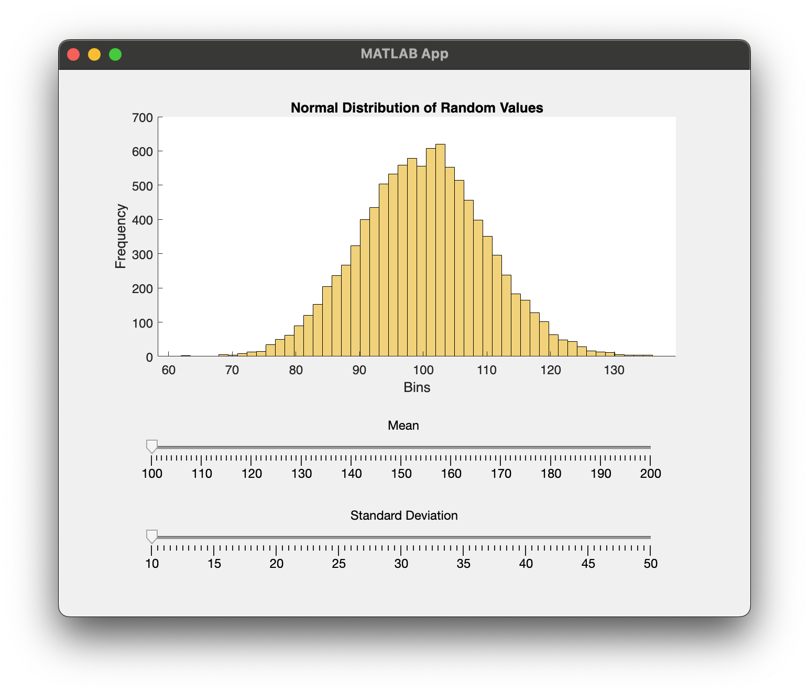
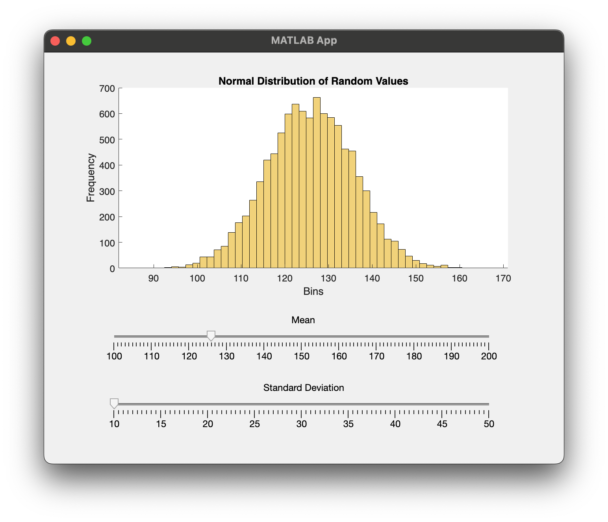
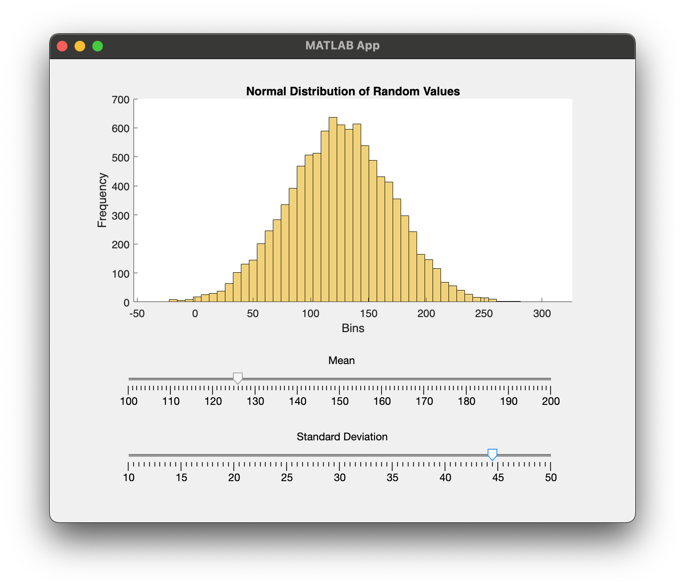

# Program\_09\_5
## Requirements
Create a Graphical User Interface that meets the following requirements:
* Shall generate 10,000 random numbers with a normal distribution
* Shall obtain the mean from a slider bar
* Shall obtain the standard deviation from a slider bar
* The mean slider bar shall start at a value of 100 and range from 100 to 200
* The standard deviation slider bar shall start at a value of 10 and range from 10 to 50
* Shall display the random numbers in a histogram with the initial data on startup
* The histogram shall have 50 bins
* Shall adjust the histogram plot upon selecting a new mean or standard deviation
* The mean and std dev sliders shall be labeled accordingly
* The histogram plot shall be labeled, and titled accordingly
* The code for generating the plot shall not be duplicated, the code shall have one function for generating and populating the plot data
* All GUI objects shall be renamed using the `prefixName` convention

Save the file as **Program_09_5.mlapp**

**Notes: **
* 

## Example Output
Your GUI layout should look similar to the following, you may play around with the design however, it should be intuitive to use and satisfy all requirements listed above

