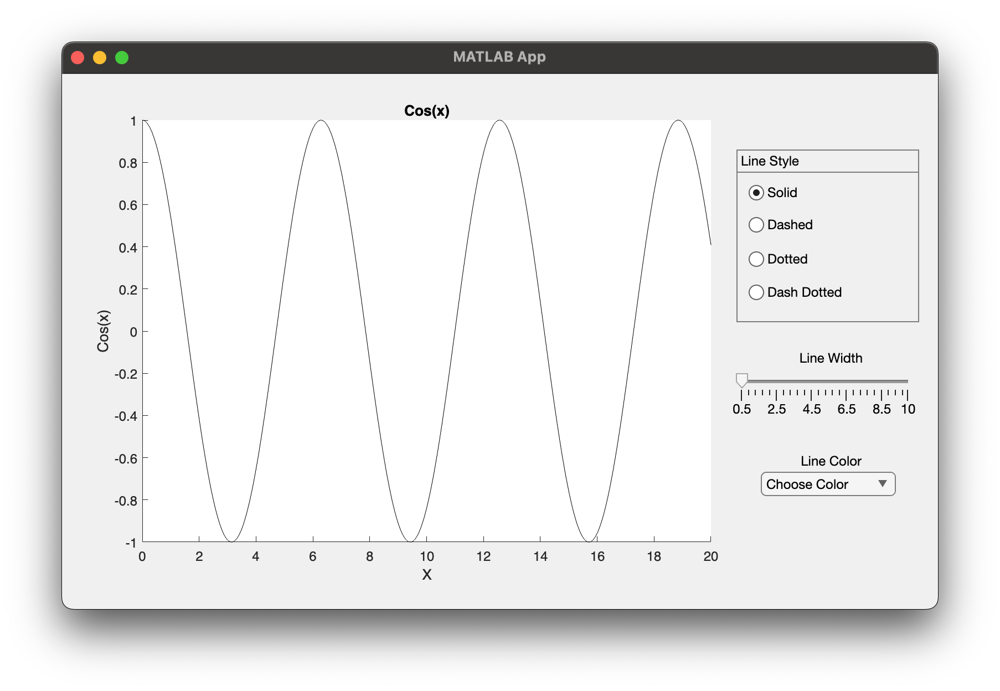
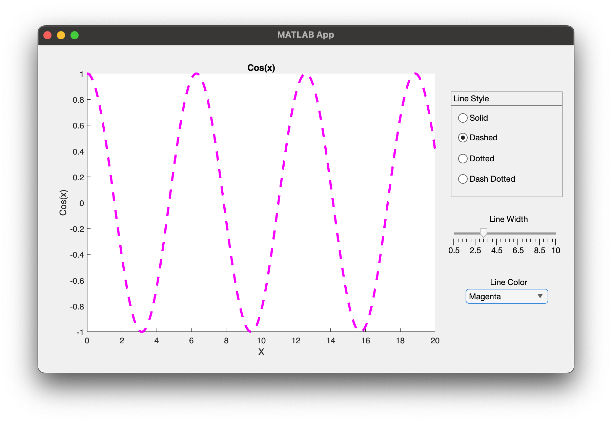
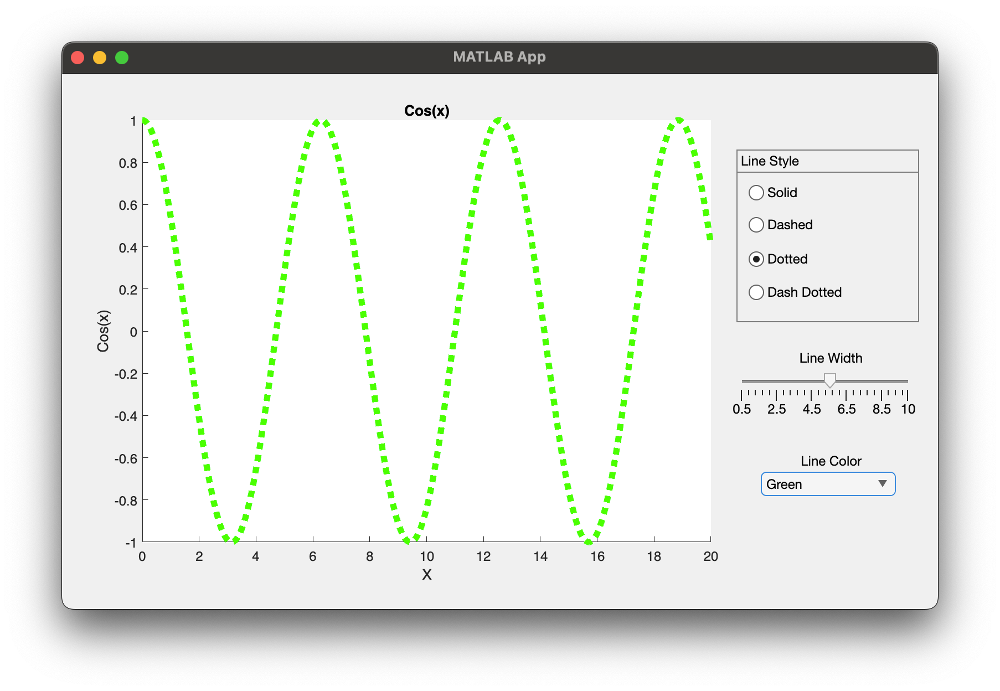
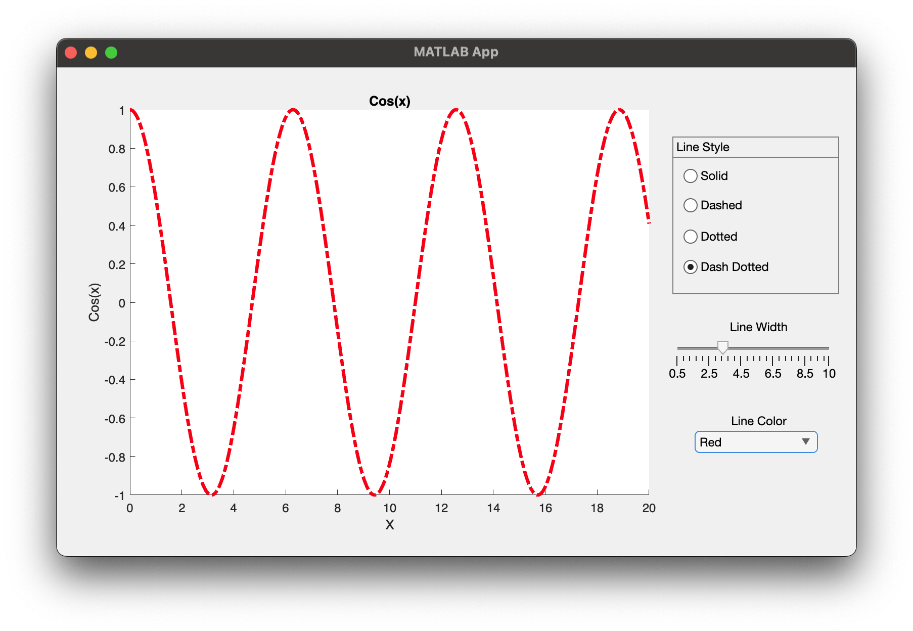

# Program\_09\_6
## Requirements
Create a Graphical User Interface that meets the following requirements:
* Shall have a plot displaying cos(x) from 0 to 20
* Shall have a 4-radio radio button group with line style options of; Solid, Dashed, Dotted, Dash Dotted
* Shall update the plot with respective Line Style selection when the selection changes
* Shall have a slider from 0.5 to 10 for Line Width
* Shall update the plot with respective Line Width selection when the selection changes
* Shall have a drop down list of color options; Choose Color, Red, Gree, Blue, Cyan, Magenta, Yellow, Black
* Shall update the plot with the respective Color selection when the selection changes
* The Plot shall be labeled and titled appropriately
* The plot update code shall not be duplicated, all changes should refer to some function that updates the plot
* The plot shall be initially populated with the settings of your choosing
* The program shall not break or error if "Choose Color" is selected, you may choose how you want to handle this situation.
* All GUI objects shall be renamed using the `prefixName` convention

Save the file as **Program_09_6.mlapp**

**Notes: **
* 

## Example Output
Your GUI layout should look similar to the following, you may play around with the design however, it should be intuitive to use and satisfy all requirements listed above

